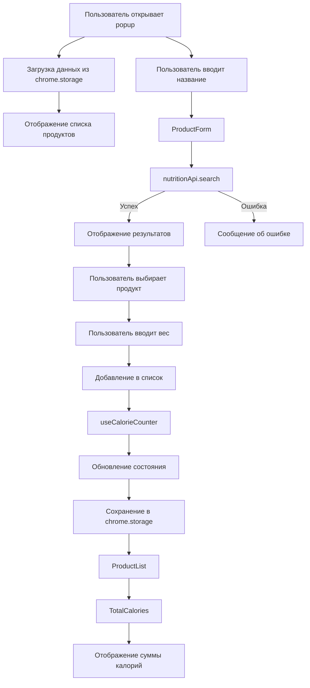

# План разработки Chrome расширения для подсчета калорий

## Обзор
Chrome расширение на WXT + React + TypeScript для отслеживания калорийности продуктов с возможностью поиска калорийности через внешнее API.

## Требования
- **Тип приложения**: Chrome расширение (popup в панели браузера)
- **Фреймворк**: WXT + React + TypeScript
- **Функционал**:
  - Список добавленных продуктов
  - Форма ввода названия продукта
  - Поиск калорийности продукта через API (калорий на 100г)
  - Подсчет общей суммы калорий
  - Удаление продуктов из списка

## Архитектура расширения

### Структура проекта (в рамках существующего проекта)
```
workshop-chrome-plugin/
├── entrypoints/
│   ├── popup.tsx              # Основной компонент popup
│   ├── background.ts           # Background скрипт (если нужен)
│   ├── content.ts              # Content script (если нужен)
│   └── options.tsx             # Страница настроек (опционально)
├── src/
│   ├── components/
│   │   ├── ProductForm.tsx       # Форма ввода продукта
│   │   ├── ProductList.tsx       # Список продуктов
│   │   ├── ProductItem.tsx       # Карточка продукта
│   │   ├── TotalCalories.tsx     # Отображение суммы калорий
│   │   └── SearchResults.tsx     # Результаты поиска из API
│   ├── services/
│   │   └── nutritionApi.ts       # Сервис для работы с API
│   ├── types/
│   │   └── index.ts              # TypeScript типы
│   ├── hooks/
│   │   └── useCalorieCounter.ts  # Кастомный хук для логики
│   ├── storage/
│   │   └── calorieStorage.ts     # Хранение данных в chrome.storage
│   └── utils/
│       └── constants.ts          # Константы приложения
├── wxt.config.ts                 # Конфигурация WXT
├── manifest.json                 # Генерируется WXT
└── package.json
```

### Варианты API для поиска калорийности

#### Вариант 1: Open Food Facts API (РЕКОМЕНДУЕТСЯ)
- **Плюсы**: Полностью бесплатный, без API ключа, открытый
- **Минусы**: Может быть менее точным для некоторых продуктов
- **Документация**: https://wiki.openfoodfacts.org/API
- **Пример запроса**: `https://world.openfoodfacts.org/cgi/search.pl?search_terms=apple&search_simple=1&action=process&json=1`

#### Вариант 2: Edamam Nutrition API
- **Плюсы**: Бесплатный план (1000 запросов/месяц), подробная информация о БЖУ
- **Минусы**: Требует регистрации API ключа
- **Документация**: https://developer.edamam.com/edamam-docs-nutrition-api

#### Вариант 3: Nutritionix API
- **Плюсы**: Хорошая документация, точные данные
- **Минусы**: Бесплатный план ограничен (500 запросов/месяц)
- **Документация**: https://developer.nutritionix.com/

**Рекомендация**: Начать с Open Food Facts API (бесплатный, без ключа)

## Этапы разработки

### Этап 1: Настройка проекта WXT + React
- [ ] Установить зависимости React для WXT (@wxt-dev/react)
- [ ] Обновить wxt.config.ts для поддержки React
- [ ] Настроить entrypoints/popup.tsx как React компонент
- [ ] Создать базовую структуру папок

### Этап 2: Определение типов
- [ ] Создать интерфейс Product:
  ```typescript
  interface Product {
    id: string;
    name: string;
    caloriesPer100g: number;
    weight: number;
    totalCalories: number;
    imageUrl?: string;
  }
  ```
- [ ] Создать интерфейс для API ответов (Open Food Facts)
- [ ] Создать интерфейс для состояния приложения

### Этап 3: Интеграция API
- [ ] Создать сервис nutritionApi.ts для работы с Open Food Facts API
- [ ] Реализовать функцию поиска калорийности:
  - Поиск по названию продукта
  - Парсинг ответа API
  - Извлечение калорийности на 100г
- [ ] Добавить обработку ошибок
- [ ] Добавить кэширование результатов (опционально)

### Этап 4: Создание компонентов UI

#### ProductForm.tsx
- Поле ввода названия продукта
- Кнопка поиска
- Отображение результатов поиска (если найдено несколько вариантов)
- Поля для ввода веса продукта (граммы)
- Кнопка добавления в список
- Индикатор загрузки при поиске

#### ProductList.tsx
- Отображение списка добавленных продуктов
- Возможность удаления продукта из списка
- Пустое состояние, если список пуст

#### ProductItem.tsx
- Название продукта
- Вес (граммы)
- Калорийность на 100г
- Общие калории продукта
- Изображение продукта (если доступно)
- Кнопка удаления

#### TotalCalories.tsx
- Отображение общей суммы калорий
- Отображение количества продуктов
- Визуальная индикация прогресса (опционально)

### Этап 5: Реализация логики
- [ ] Создать хук useCalorieCounter:
  - Управление состоянием списка продуктов
  - Функция поиска продукта в API
  - Функция добавления продукта
  - Функция удаления продукта
  - Функция подсчета общей суммы калорий
- [ ] Интеграция с chrome.storage для сохранения данных
- [ ] Загрузка сохраненных данных при открытии popup

### Этап 6: Стилизация
- [ ] Создать компактный дизайн для popup (ограниченная ширина)
- [ ] Использовать CSS модули или Tailwind CSS
- [ ] Адаптивная верстка для разных размеров popup

### Этап 7: Тестирование
- [ ] Тестирование поиска продуктов
- [ ] Тестирование добавления/удаления
- [ ] Тестирование подсчета калорий
- [ ] Тестирование сохранения/загрузки данных
- [ ] Тестирование в разных браузерах (Chrome, Edge, Firefox)

## Диаграмма потока данных



## Технологический стек

- **Framework**: WXT (Web Extension Tools)
- **Frontend**: React 18 + TypeScript
- **Storage**: chrome.storage API
- **HTTP Client**: Axios или fetch
- **Styling**: CSS Modules или Tailwind CSS
- **API**: Open Food Facts (начальный вариант)

## Конфигурация WXT

### Обновление wxt.config.ts
```typescript
import { defineConfig } from 'wxt';

export default defineConfig({
  modules: ['@wxt-dev/react'],
  manifest: {
    name: 'Calorie Counter',
    description: 'Приложение для подсчета калорий',
    version: '1.0.0',
    permissions: ['storage'],
  },
});
```

### Обновление package.json
```json
{
  "dependencies": {
    "@wxt-dev/react": "^1.0.0",
    "react": "^18.2.0",
    "react-dom": "^18.2.0"
  }
}
```

## Дополнительные улучшения (для будущих версий)

- [ ] Отображение БЖУ (белки, жиры, углеводы)
- [ ] История поиска продуктов
- [ ] Экспорт/импорт списка продуктов
- [ ] Графики и статистика
- [ ] Темная тема
- [ ] Уведомления о достижении целей
- [ ] Интеграция с Google Fit или Apple Health
- [ ] Страница настроек для целей по калориям
- [ ] Быстрое добавление избранных продуктов

## Особенности Chrome расширения

### Преимущества:
- Быстрый доступ через popup
- Работает на любой странице
- Сохранение данных в chrome.storage
- Не требует отдельного сервера

### Ограничения:
- Размер popup ограничен (обычно 400-600px в ширину)
- CSP (Content Security Policy) ограничения
- Требует разрешений в manifest.json
